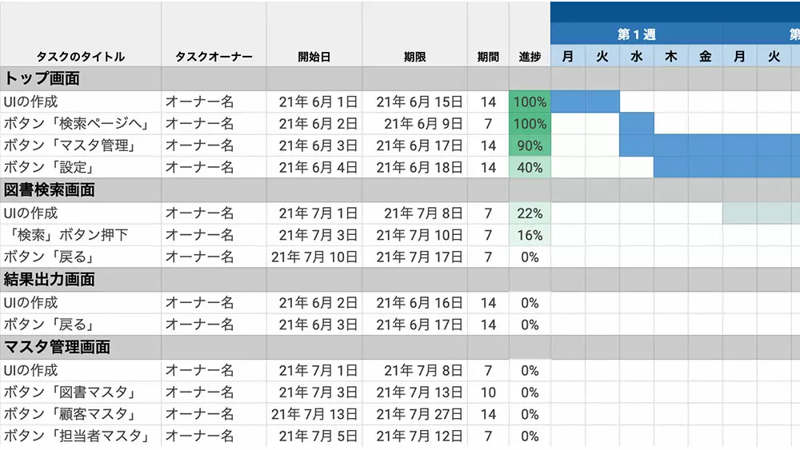
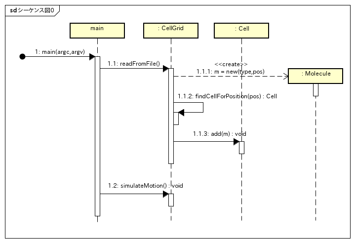
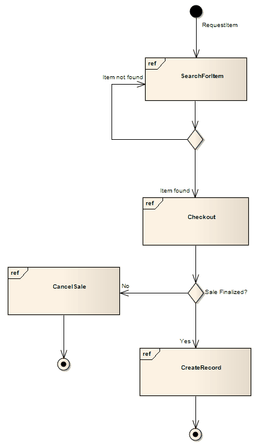
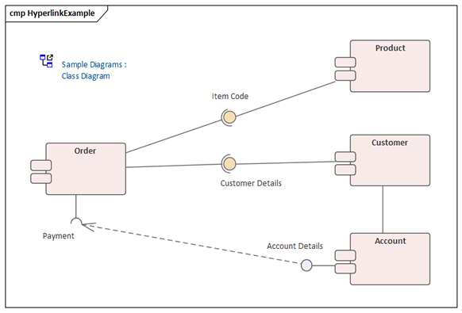
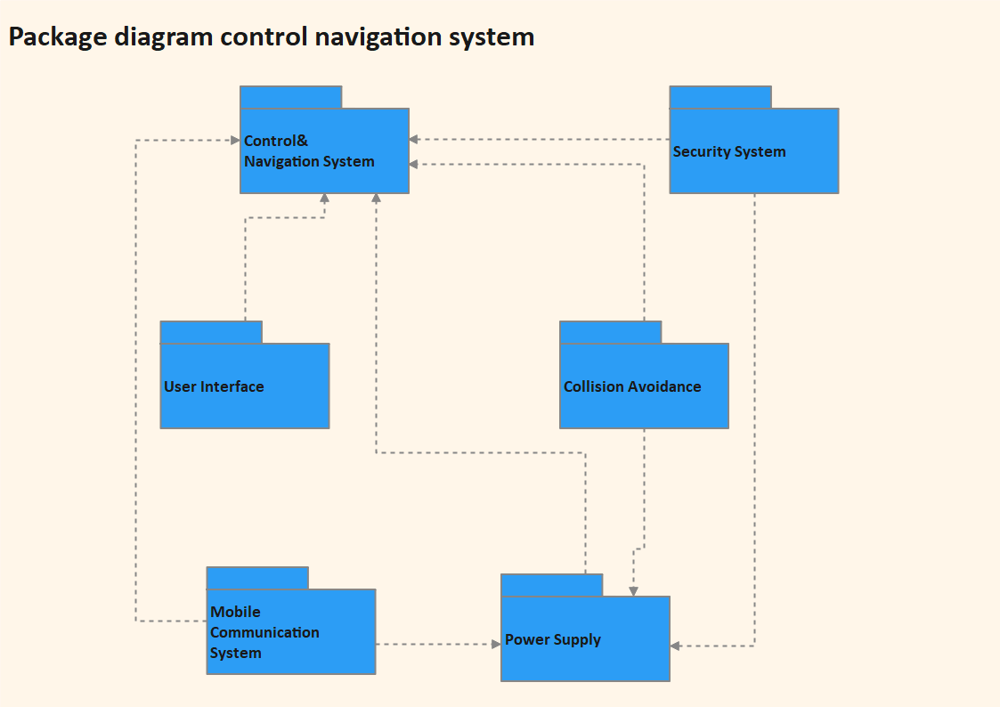
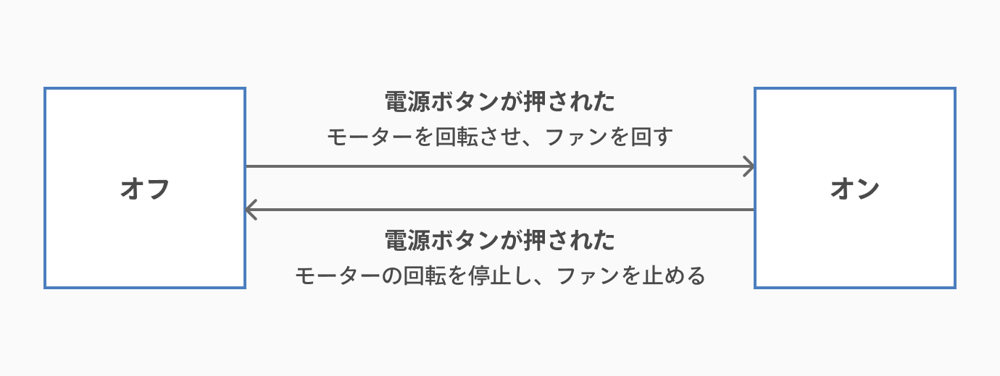

# ソフトウェア工学

## 講義内容

| 講義回       | 内容                   |
|:-------------|:---------------------:|
| 第１回~第３回 | ソフトウェア工学概論    |
| 第４回~第７回 | プロジェクトマネジメント |
| 第８回 　　　 | UML                    |
| 第９回 　　　 | コーディング            |
| 第10回~第14回 | Git/GitHub             |

## 1. ソフトウェア工学概論

### 1-a. ソフトウェア工学とは？
#### ソフトウェア : 「情報を」扱うプロダクトそのもの、プロダクトを提供する手段。
	<ソフトウェアの定義>
	1. 実行されることによって必要な特性、機能、性能を提供する命令語群（コンピュータプログラム）。
	2. プログラムが適切に情報を扱うことを可能とするデータ構造。
	3. プログラムの操作や使用法を記述した情報。

#### ソフトウェア工学 : ソフトウェアの「品質」、「コスト」、「納期」の最適なバランスを実現するための手法・方法論。
	<ソフトウェア工学の必要性>
	1. 大規模化と複雑さ
	2. IT人材の不足
	3. 社会性と求められるミッション
	4. 不確実性の増大

### 1-b. ソフトウェアライフサイクル
#### ソフトウェアライフサイクル
1. ソフトウェアの誕生
	- ニーズの発生
	- ビジネス上あるいはシステム上の要求を具現化するための企画・計画を行う
	- 要件定義書をまとめる


2. ソフトウェアの開発・運用
	- ソフトウェアの開発
	- 実稼働
	- 保守運用


3. ソフトウェアの廃止
	- サービスの終了
	- 新規ソフトウェアへのリニューアル


## 2. プロジェクトマネジメント

### 2-a. プロジェクト
#### プロジェクトとは？
	有期性：ルーティンワークなどとは異なり、終わりが必ず存在する類の仕事。
	独自性：ソフトウェア開発などのように、独自の目的を達成する類の仕事。

#### フォアキャスティング・バックキャスティング
フォアキャスティング：学校の勉強のように、今の立ち位置から順に目標に進んでいく手法
```
目標に到達できない可能性や、目標から離れたところに到達する可能性がある。
```
バックキャスティングプロジェクト：定めた目標に向けて何が必要かを計画し達成に向かう手法
```
プロジェクトのように、定めた目標に向けて何が必要かを計画し達成に向かう手法。
目標を明確に設定する必要と、目標に向けての道筋を検討する必要がある。
プロジェクト業務はバックキャスティングである。
```

### 2-b. ソフトウェア分析
#### QCD
- QCD：品質（Quality）、コスト（Cost）、納期（Delivery）
- QCDの優先度
	- 品質優先：人命に影響があるようなシステム
	- 費用優先：公共関連システム
	- 納期優先：イベント行事関連システム

#### ソフトウェアの評価
1. コードの物量（ステップ数）：例えばC言語換算でのソースコード行数（総ステップ数）
2. コードの物量（オブジェクト容量）：組み込み型ソフトウェアはサイズが小さいほどよい
3. ファンクションポイント（FP）法：システム規模の概算
4. 使い勝手
	- 画面の視認性
	- 操作性
	- 入力補助
	- 互換性
	- ガイダンス など

### 2-c. 開発プロセス
#### ウォーターフォール型開発プロセス
	要件定義から総合テストの上流から下流までを一つの大きな流れとして行う開発手法。
	進捗管理が容易、成果物が明確といった利点があるが、後工程にしわ寄せが集中というリスクがある。

#### スパイラルモデル
	プログラム開発を小さなフェーズに分割する開発手法。
	フェーズごとにプロトタイプによるデモンストレーションを行い、その都度フィードバックを行う。
	プロトタイプ作成に想定外の作業量が発生するリスクがある。

#### 反復型開発プロセス
	ソフトウェアを機能分割し、これを「反復」と呼ぶ単位で管理する手法。
	メリットして、部品ごとに作成していくため顧客の要望が取り入れやすく、部分的な納品が可能である。
	デメリットとして、分割のため作業量が増えることや全体像が見えずらいことがあげられる。

#### アジャイルプロセス
	変化に対応して無駄を廃し、最適な手法で動くソフトウェアの提供を優先する開発手法。
	ウォーターフォール型開発プロセスでは想定されていなかった「できるだけ決定を遅らせる」、「できるだけ早く提供する」を実現する。
	計画を硬直的に守るよりも変化への対応をすることや、プロセスやツールよりも、個人や個人や相互作用を重視することが価値である。

※開発手法はどれも一長一短であり、ハイブリット型も多い。

### 2-d. WBS
#### wbsとは？
	プロジェクト目標を達成し、必要な要素成果物を生成するために、プロジェクトチームが実行する作業を、要素成果物を主体に階層的に要素分解したもの

#### wbsのメリット
- やることの範囲が明確になる（やらないことが明確になる）
- 作業を洗い出す（やるべき作業が明確になる）
- 全体管理と作業計画が明確化される
- プロジェクト実施時はWBSに則り実行するのみ

#### wbsの例

引用＜jooto; https://www.jooto.com/contents/wbs/ ＞

## 3. UML
### 3.a UMLとは？
	万国共通の記法であり、オブジェクト指向プログラミングで書かれている。
	文章によるドキュメントに加えて開発・設計を図示化（モデル化）する。

### 3.b UMLの様々な図
- ユースケース図
	- 
- アクティビティ図

- クラス図

- オブジェクト図

- シークエンス図
	- 時間の前後関係やタイミングを表現できる

<br>引用＜Enterprise Architect; https://lecture.ecc.u-tokyo.ac.jp/hideo-t/references/uml/sequence-diagram/sequence-diagram.html ＞

- コミュニケーション図
	- シークエンス図を書き換えたもの
	- 通信リンクを使って接続形態やネットワーク構成が表現できる

<br>引用＜Enterprise Architect; https://www.sparxsystems.jp/help/16.0/timingdiagram.html ＞

- タイミング図
	- オブジェクト間の相互作用のタイミングと状態遷移を表現したもの

<br>引用＜Enterprise Architect; https://www.sparxsystems.jp/help/16.0/timingdiagram.html ＞

- 相互作用概要図（iod）
	- システムの鳥瞰図
	- sd: シークエンス図
	- cd: コミュニケーション図
	- td: タイミング図
	- これらの相互作用をアクションとするアクティビティ図

<br>引用＜Enterprise Architect; https://www.sparxsystems.jp/help/16.0/interactionoverviewdiagram.html ＞

- コンポーネント図
	- コンポーネント：複数のクラスで構成される処理に対して１つ以上のインターフェースを用意し、あたかも１つのクラスのように取り扱ったもの
	- カプセル化されたソフトウェアパーツの管理を目的とした図
	- 「コンポーネント」はタグ付アイコンで表現

<br>引用＜Enterprise Architect; https://www.sparxsystems.jp/help/16.0/componentdiagram.html ＞

- パッケージ図
	- クラス図のうち”package”であるクラスを抽出
	- パッケージの依存関係を表現し管理

<br>引用＜wondershare; https://www.edrawsoft.com/jp/what-is-uml-package-diagram.html ＞

- 状態マシン図
	- トリガーによるオブジェクトの状態遷移を表現

<br>引用＜cacoo by nulab; https://cacoo.com/ja/blog/what-is-state-machine-diagram/ ＞

- 配置図
	- ハードウェアの構成を表現

<br>引用＜wondershare; https://www.edrawsoft.com/jp/uml-deployment-diagram-example.html ＞

## git

~gitについて~

### 主な git commands

~commmandの説明~